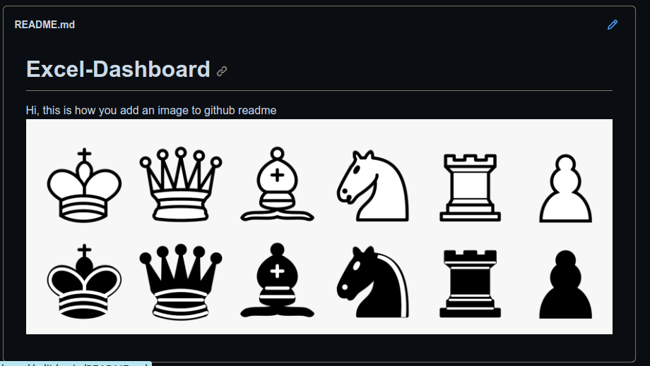

# Chess Games Analysis Dashboard
This Excel dashboard analyzes data from over 20,000 chess games played on Lichess, sourced from Maven Analytics. It provides insights into game outcomes, player ratings, opening strategies, and more.

# Key Questions Answered
1. Percentage of Games Won by White and Draws
Analyzes the distribution of game outcomes between wins by White, wins by Black, and draws.
2. Most Frequently Used Opening Moves
Identifies the top opening moves in games won by Black and White separately.
3. Impact of Player Ratings on Game Outcomes
Examines the percentage of games won by players with higher ratings and explores variations based on piece color.
4. Rating Comparison in terms of Games Played

# Dashboard Navigation
Games Overview: Summary of game outcomes and percentage distribution.
Openings Analysis: Charts and tables showing popular opening moves by game results.
Rating Impact: Visualizations comparing game outcomes based on player ratings.
Top Players: Leaderboard of users with the most wins and rating comparisons.

# Usage Instructions
Open the Excel file and navigate through different sheets for detailed analysis.
Use filters and interactive elements to explore specific data points.
For more details on methodology and data sources, refer to the 'About' section within the dashboard.
Data Sources
The dataset is sourced from Maven Analytics and includes game details such as moves, victor, player ratings, and opening moves.

License
This dashboard is shared under [Specify your license terms].

Contact
For questions or support, contact Krishnakoli Datta at [Your contact information].

To upload files go to Add files option and upload.

To download the entire repository, go to the code part and Download zip. Try this and then get started
